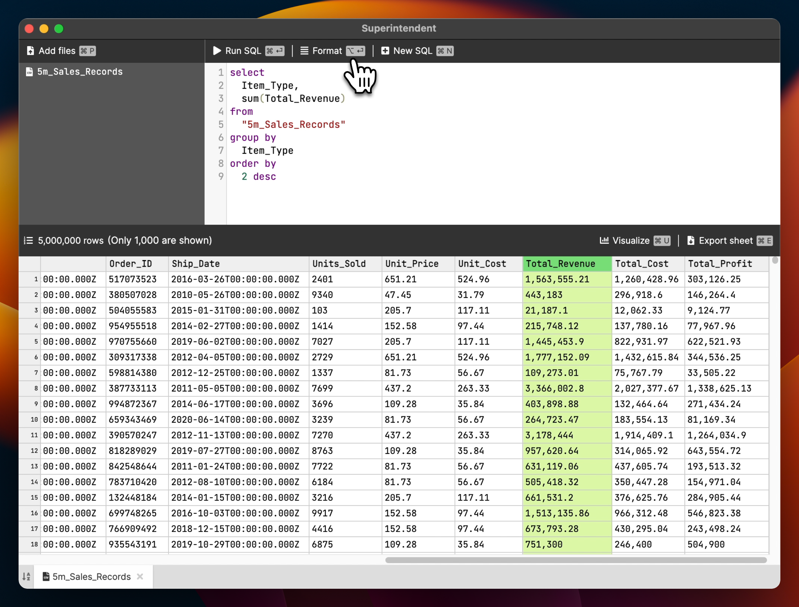

Superintendent.app
====================

Your SQL spreadsheet app

You can write SQL to query and visualize gigabytes of CSV files on your local machine. 
Superintendent.app is a desktop application that works offline an protects your data privacy.

It works on Mac, Windows, and Linux. Please visit our website to download the app: [https://superintendent.app](https://superintendent.app)

[](https://superintendent.app/assets/images/1e0720bf34b0fdc0741452cdcf2c3f91-superintendent-demo.mp4)

[Click here to watch the video](https://superintendent.app/assets/images/1e0720bf34b0fdc0741452cdcf2c3f91-superintendent-demo.mp4)

Development
------------

1. `yarn` to install the dependencies. 
2. run `yarn run build:watch` and `yarn run start` in 2 separate windows to start Electron with hot reload.
3. Run tests: `yarn install` and `yarn jest`.
   - Run specific test based on pattern: `yarn jest -t <substring>`
4. Download `chromedriver` and put it in the root folder. It has to be the version `134.0.6998.165` because it is compatible with the Electron version that we use.
   - Linux: https://storage.googleapis.com/chrome-for-testing-public/134.0.6998.165/linux64/chromedriver-linux64.zip
   - Mac: https://storage.googleapis.com/chrome-for-testing-public/134.0.6998.165/mac-arm64/chromedriver-mac-arm64.zip
   - Windows: https://storage.googleapis.com/chrome-for-testing-public/134.0.6998.165/win64/chromedriver-win64.zip
5. Run the tests: `yarn wdio`. 
   - Run `yarn wdio --spec ./test/specs/draft_notice.e2e.ts` to run specific tests.

We invest in having a good set of tests because it helps us maintain the application over an extended period of time.

Secrets
--------

There are 4 secrets:

1. `./secrets/VALID_LICENSE` is for running `yarn wdio`. This is required for running tests.
2. `./secrets/GLITCHTIP_URL` is for enabling the error tracking for glitchtip.com.
3. `./secrets/APTABASE_KEY` is for enabling the Aptabase's telemetry.
4. `./secrets/license.json` is for running the contract test on the license validation.

Mac build
----------

Run `GH_TOKEN=<github_token> APPLEID=<EMAIL> APPLEIDPASS=<PASS> yarn dist:mac`

You can skip the notarization (i.e. code signing) by setting: `export SKIP_CODE_SIGNING=true`

We can check the notarization status with: `spctl -a -vvv -t install ./electron-builder/out/mac-arm64/superintendent.app`

The DMG cannot be, and is not, notarized.

Linux & Window build
----------------------

We currently use the Docker option of electron-builder. However, we have to use a modified Docker image due to the new yarn version. 
See: https://github.com/electron-userland/electron-builder/issues/9040

1. Download the CodeSignTool from SSL.com: https://www.ssl.com/guide/esigner-codesigntool-command-guide/
2. Unzip and put it under `./scripts/CodeSignTool-v1.3.2`.
3. Run `chmod 755 /scripts/CodeSignTool-v1.3.2/CodeSignTool.sh`
4. Go to `cd ./scripts`
5. Run: `docker buildx build -t electronuserland/builder:wine --platform=linux/amd64 .`
6. Go to the project root with `cd ..`
7. Run tests: `npm install --force && yarn install`.
8. Run the below docker command ([ref](https://www.electron.build/multi-platform-build.html#docker)):

```
docker run --rm -ti \
  --env-file <(env | grep -iE 'DEBUG|NODE_|ELECTRON_|YARN_|NPM_|CI|CIRCLE|TRAVIS_TAG|TRAVIS|TRAVIS_REPO_|TRAVIS_BUILD_|TRAVIS_BRANCH|TRAVIS_PULL_REQUEST_|APPVEYOR_|CSC_|GH_|GITHUB_|BT_|AWS_|STRIP|BUILD_') \
  --env ELECTRON_CACHE="/root/.cache/electron" \
  --env ELECTRON_BUILDER_CACHE="/root/.cache/electron-builder" \
  --platform linux/amd64 \
  -v ${PWD}:/project \
  -v ${PWD##*/}-node-modules:/project/node_modules \
  -v ~/.cache/electron:/root/.cache/electron \
  -v ~/.cache/electron-builder:/root/.cache/electron-builder \
  electronuserland/builder:wine
```

Now that you are in the docker console:

- Run `yarn && GH_TOKEN=<github_token> yarn dist:linux` for Linux
- Run `yarn && GH_TOKEN=<github_token> SSL_USERNAME=<ssl_com_user> SSL_PASSWORD=<ssl_com_pass> yarn dist:win` for Windows

You can skip the code signing by setting: `export SKIP_CODE_SIGNING=true`

### Validate that the binary is signed correctly on Windows

1. Open PowerShell
2. Run `powershell -command "Get-AuthenticodeSignature -FilePath \"<file>\""`


